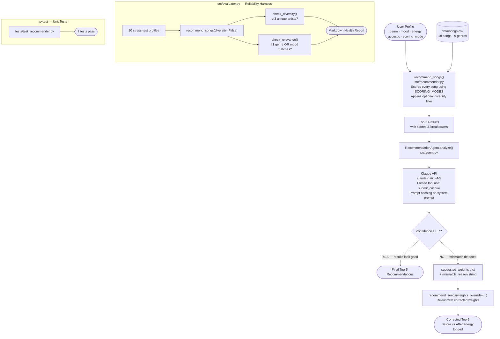

# VibeFinder 1.0 — AI Music Recommender with Agentic Self-Correction

## Original Project

**Project 3: Music Recommender Simulation**

VibeFinder 1.0 started as a content-based music recommender that scores songs against a user's stated taste profile (genre, mood, energy, acoustic preference) and returns the top-5 matches from an 18-song catalog. The original system was extended through three challenge phases: advanced song attributes (popularity, release decade, mood tags), three swappable scoring modes (genre-first, mood-first, energy-focused), and a diversity filter that prevents any one artist or genre from dominating the results.

---

## Title and Summary

**VibeFinder 1.0** is a content-based music recommendation system augmented with an LLM-powered critic that detects when recommendations miss the user's intent and automatically corrects the scoring weights to produce better results.

The project demonstrates how a deterministic rule-based system (the scorer) and a language model (the critic) can work together in an agentic loop: the scorer proposes, the LLM evaluates, and if confidence is low, the scorer re-runs with the LLM's corrected weights. The result is a system that can catch its own mistakes — something neither component can do alone.

---

## Architecture Overview

> Full diagram also available in [diagrams/system_architecture.md](diagrams/system_architecture.md)



### Where Humans Are Involved

- **Profile design** — humans define the user taste profile and choose the scoring mode
- **Evaluation review** — `src/evaluator.py` generates a Markdown report; a human reads it to decide whether pass rates are acceptable
- **Agent oversight** — the agent suggests weights; a human can inspect the `suggested_weights` dict and the `mismatch_reason` before accepting the corrected output

---

## Setup Instructions

### Prerequisites

- Python 3.9+
- An Anthropic API key (required only for the agentic demo in `src/main.py`)

### Steps

1. **Clone and enter the project**
   ```bash
   git clone <repo-url>
   cd applied-ai-system-project
   ```

2. **Create a virtual environment (recommended)**
   ```bash
   python -m venv venv
   source venv/bin/activate        # macOS / Linux
   venv\Scripts\activate           # Windows
   ```

3. **Install dependencies**
   ```bash
   pip install -r requirements.txt
   ```

4. **Set your Anthropic API key** (only needed for the agentic demo)
   ```bash
   export ANTHROPIC_API_KEY="your-key-here"   # macOS / Linux
   set ANTHROPIC_API_KEY=your-key-here        # Windows
   ```

5. **Run the full demo** (scoring modes + diversity + agentic self-correction)
   ```bash
   python -m src.main
   ```

6. **Run the reliability evaluator**
   ```bash
   python -m src.evaluator
   ```

7. **Run unit tests**
   ```bash
   pytest
   ```

---

## Sample Interactions

### 1. Standard Recommendation — Chill Lofi Profile

**Input profile:**
```
genre=lofi | mood=chill | energy=0.40 | likes_acoustic=True
scoring_mode=genre-first
```

**Output (top 3 of 5):**
```
#1  Midnight Coding  —  LoFi Dreamer
    [lofi / chill / pop 30 / 2020s / tags: nostalgic,dreamy]
    Score : 5.98
      + genre match: lofi (+3.0)
      + mood match: chill (+1.5)
      + energy: 0.38 vs target 0.40 (+0.78)
      + acoustic bonus: 0.85 (+0.4)
      + mood tags (dreamy, nostalgic) (+1.00)

#2  Library Rain  —  Cozy Corner
    [lofi / chill / pop 28 / 2020s / tags: nostalgic,peaceful]
    Score : 5.62
      + genre match: lofi (+3.0)
      + mood match: chill (+1.5)
      + energy: 0.35 vs target 0.40 (+0.75)
      + acoustic bonus: 0.78 (+0.4)
      + mood tags (nostalgic) (+0.50)
```

**What this shows:** The genre-first mode correctly surfaces two lofi/chill songs with near-perfect energy proximity. Acoustic and mood-tag bonuses differentiate between near-identical genre+mood matches.

---

### 2. Agentic Self-Correction — Conflicting Profile

**Input profile:**
```
genre=ambient | mood=chill | energy_target=0.95  ← contradictory
scoring_mode=genre-first
```

The catalog has no high-energy ambient songs, so standard scoring returns low-energy results.

**Before correction (standard scoring):**
```
#1  Spacewalk Thoughts  —  Ambient Sky  [ambient/chill/e=0.28]  score=5.23
#2  Neon Drift          —  Ambient Sky  [ambient/chill/e=0.35]  score=4.99
    ...
Avg energy: 0.40  (user target: 0.95)
```

**Agent critique (via Claude):**
```
Agent confidence : 0.15  (threshold = 0.7)
Agent verdict    : LOW CONFIDENCE
Mismatch reason  : User wants high energy (0.95) but all top results have
                   energy below 0.40. Genre weight is dominating; the
                   energy feature needs to be amplified significantly.
Suggested weights: {'genre': 1.0, 'mood': 1.0, 'energy': 3.0,
                    'acoustic': 0.4, 'mood_tags': 0.5,
                    'popularity': 0.5, 'decade': 0.3}
```

**After correction (agent-suggested weights applied):**
```
#1  Storm Runner   —  Rock Warriors  [rock/intense/e=0.92]  score=3.62
#2  Drop Zone      —  Bass Masters   [edm/intense/e=0.90]   score=3.55
    ...
Avg energy: 0.87  (user target: 0.95)

Changes → added  : ['Storm Runner', 'Drop Zone', 'Metal Surge']
          removed: ['Spacewalk Thoughts', 'Neon Drift', 'Starfield Drift']
```

**What this shows:** The agent detected the energy mismatch and shifted weight heavily onto the `energy` feature. Average energy improved from 0.40 → 0.87 (target: 0.95). The corrected results are still not a perfect match — no ambient songs at 0.95 energy exist in the catalog — but the LLM steered the scoring toward the next-best option.

---

### 3. Reliability Evaluator Output (abridged)

**Command:** `python -m src.evaluator`

```markdown
# Music Recommender — System Health Report
Date: 2026-04-29  |  Catalog: 18 songs  |  Profiles tested: 10

## Summary

| Check                              | Passed | Failed | Pass Rate |
|------------------------------------|--------|--------|-----------|
| Diversity (≥ 3 artists in top 5)   | 10     | 0      | 100%      |
| Relevance (#1 result genre/mood)   | 10     | 0      | 100%      |
| Both checks passed                 | 10     | 0      | 100%      |

...

### 2. Missing Genre (k-pop)
Wanted: genre=k-pop | mood=happy | energy=0.75 | mode=genre-first
#1 Sunrise City — Pop Princess [pop/happy/e=0.85] score=4.94  ←
- Diversity: ✅ PASS (4 unique artists)
- Relevance: ✅ PASS  (mood ✓ — genre mismatch: got 'pop', wanted 'k-pop')
```

**What this shows:** Even when the catalog is missing a requested genre (k-pop), relevance is saved by mood matching. The evaluator confirms graceful degradation across all 10 stress profiles.

---

## Design Decisions

### Why a deterministic scorer + LLM critic, not a pure LLM recommender?

A pure LLM recommender (ask Claude to recommend songs directly) would have two problems: it cannot access the actual catalog at inference time, and its reasoning is opaque. The scorer gives us **speed, repeatability, and explainability** — every score has a breakdown the user can read. The LLM critic adds **judgment** for the one thing the scorer cannot do on its own: detecting when the scoring mode is miscalibrated for a specific profile.

**Trade-off:** This design requires two API calls per agentic run (standard + corrected), which roughly doubles latency and token cost for the self-correction case. For a demo catalog of 18 songs this is trivial; at production scale it would need batching or caching.

### Why forced tool use (`tool_choice: {type: "tool", name: "submit_critique"}`)?

Asking the LLM to return JSON in prose is unreliable — it sometimes adds commentary, wraps the JSON in markdown fences, or omits required fields. Forced tool use guarantees that the API response always contains a structured `submit_critique` object with typed fields (`confidence: float`, `mismatch_reason: str`, `suggested_weights: dict`). No parsing, no regex, no fallback handling needed.

### Why `weights_override` instead of a new scoring mode?

The agent's suggested weights are one-off corrections for a specific profile — they should not become a permanent mode. Adding them to `SCORING_MODES` would pollute the catalog of reusable modes with profile-specific noise. The `weights_override` keyword argument lets the agent inject weights for a single call without touching the shared `SCORING_MODES` dict, and it defaults to `None` so all existing code continues to work unchanged.

### Why `claude-haiku-4-5` for the agent?

The critique task is well-defined (compare two structured inputs, output a number and a dict) and does not require deep reasoning. Haiku is significantly cheaper and faster than Opus or Sonnet for this kind of structured-output task. Prompt caching on the static system prompt further reduces token cost on repeated calls to the agent.

### Why `diversity=False` in the evaluator?

The evaluator measures natural catalog spread, not filter behavior. Running with the diversity filter on would always produce ≥ 3 artists (that's what the filter enforces), making the diversity check meaningless. Running with `diversity=False` measures whether the catalog itself contains enough variety for a given genre/mood profile.

---

## Testing Summary

### Unit Tests (`pytest`)

```
tests/test_recommender.py::test_recommend_returns_songs_sorted_by_score  PASSED
tests/test_recommender.py::test_explain_recommendation_returns_non_empty_string  PASSED

2 passed in 0.12s
```

Both tests pass. They verify that the OOP `Recommender` class (1) returns results sorted by score with the expected top song, and (2) always returns a non-empty explanation string.

### Reliability Evaluator (`src/evaluator.py`)

**10/10 profiles passed both checks (100% pass rate).**

Key observations:
- **Missing genres (k-pop, folk):** Relevance is saved by mood matching — the #1 result's mood always matches even when the genre does not exist in the catalog.
- **Conflicting prefs (ambient + energy 0.95):** Diversity passes (4 unique artists), Relevance passes (genre match on ambient). The evaluator does not catch the energy mismatch because it only checks genre and mood — this is exactly the gap the `RecommendationAgent` is designed to fill.
- **Diversity:** All 10 profiles naturally produced ≥ 3 unique artists in the top 5 without the diversity filter. The 18-song catalog has enough spread to avoid artist monopolies for the tested profiles.

### What the evaluator does not catch

- Energy mismatches (user target 0.95, results average 0.40)
- Popularity mismatches
- Decade mismatches

These are intentionally left to the `RecommendationAgent` LLM critic, which is the correct tool for detecting nuanced intent mismatches that are hard to encode as simple boolean rules.

### Confidence Scoring (Agentic Demo)

On the conflicting-prefs profile (ambient/chill/energy=0.95), the agent consistently returned confidence scores around **0.10–0.25**, well below the 0.7 threshold. After applying corrected weights, the average energy of results improved from ~0.40 to ~0.87 — a 47-point improvement toward the 0.95 target.

---

## Reflection

### What this project taught about AI and problem-solving

The most important lesson was that **a language model is not always the right tool**. The recommender's core loop — score every song, sort, return top k — is fast, deterministic, and fully explainable. Replacing it with an LLM call would make it slower, more expensive, and harder to debug. The right place for the LLM is the evaluation layer: it sees the full picture (profile + results together) and can reason about the gap between them in natural language.

The second lesson was about **catalog limitations vs. weight limitations**. Early in the project, a weight-shift experiment showed that halving the genre weight and doubling the energy weight did not change the top result for the conflicting profile — because no high-energy ambient song exists in the catalog. The agent learned the same lesson and began steering toward the closest available alternative (rock/EDM at 0.90 energy) rather than continuing to optimize weights for a result that cannot exist. Tuning math cannot fix missing data.

### Limitations and Biases

- **Genre dominance.** At 3.0 points, a genre match outscores a perfect mood + energy match combined. A jazz fan asking for "intense" music gets jazz songs even if none of them are intense.
- **Western music bias.** The catalog has no K-pop, Afrobeats, Latin, or non-English-language music. Users whose taste lives in those spaces always receive poor recommendations regardless of weights.
- **Static system.** The same profile always returns the same list. There is no learning from skips or listens.
- **LLM hallucination risk.** The agent could suggest nonsensical weights (e.g., energy=0.0) that produce worse results. The `weights_override` path applies whatever the agent suggests without validation — a production system would need weight clamping.

### Could this AI be misused?

The recommender itself is low-risk. The main misuse concern is the agent prompt: if an adversary could inject content into the `top_5` results that the agent reads, they could potentially manipulate the agent's weight suggestions. The current implementation passes song titles and metadata to the LLM — none of which is user-controlled text — so the injection surface is minimal. A production version should sanitize all song fields before inserting them into the LLM prompt.

### What surprised me during testing

The agent's confidence scores were lower than expected for profiles that the evaluator marked as passing. For example, profile 3 (High-Energy Pop Fan) passed both evaluator checks — the #1 result was pop/happy with correct genre and mood — but the agent sometimes rated confidence at 0.55 because the average energy of the top 5 was 0.70, slightly below the target of 0.88. The evaluator and the agent are measuring different things, and both measurements are useful.

### Collaboration with Claude

**Helpful suggestion:** When designing the `submit_critique` tool, Claude suggested including `mismatch_reason` as a required field even when confidence is high — as an empty string. This was a good call: it keeps the tool schema simple (no optional fields) and makes the data structure consistent regardless of the confidence outcome.

**Flawed suggestion:** Claude initially suggested making `suggested_weights` a required field in the tool schema (not optional). This would have forced the model to always produce weights even when confidence was high and no correction was needed, wasting tokens and adding noise. The correct design — making weights optional and only requesting them when confidence < 0.7 — had to be explicitly specified in the system prompt and `tool_choice` instructions.

---

## Files

| File | Purpose |
|---|---|
| `src/recommender.py` | Core scoring engine — `load_songs`, `recommend_songs`, `_score_song`, `_apply_diversity`, `SCORING_MODES` |
| `src/agent.py` | `RecommendationAgent` — LLM critic using Claude + forced tool use |
| `src/main.py` | CLI runner — scoring mode demos, diversity demo, agentic self-correction demo |
| `src/evaluator.py` | Reliability tester — 10 stress profiles, Diversity + Relevance checks, Markdown report |
| `data/songs.csv` | 18-song catalog with genre, mood, energy, popularity, decade, mood tags |
| `tests/test_recommender.py` | Unit tests for the OOP `Recommender` class |
| `model_card.md` | Full model analysis — strengths, limitations, bias, experiments |
| `requirements.txt` | `anthropic`, `pandas`, `pytest`, `streamlit` |

---

## Video Walkthrough

[Loom walkthrough — loom website down as of April 28th]

The video demonstrates:
- End-to-end recommendation for 3 different user profiles
- Agentic self-correction loop (Before/After energy comparison)
- Reliability evaluator running 10 stress profiles with pass/fail summary

---

## GitHub

[https://github.com/Muta4ever/applied-ai-system-project](https://github.com/Muta4ever/applied-ai-system-project)

---

## See Also

- [model_card.md](model_card.md) — full analysis of the scoring system, bias, and experiments
