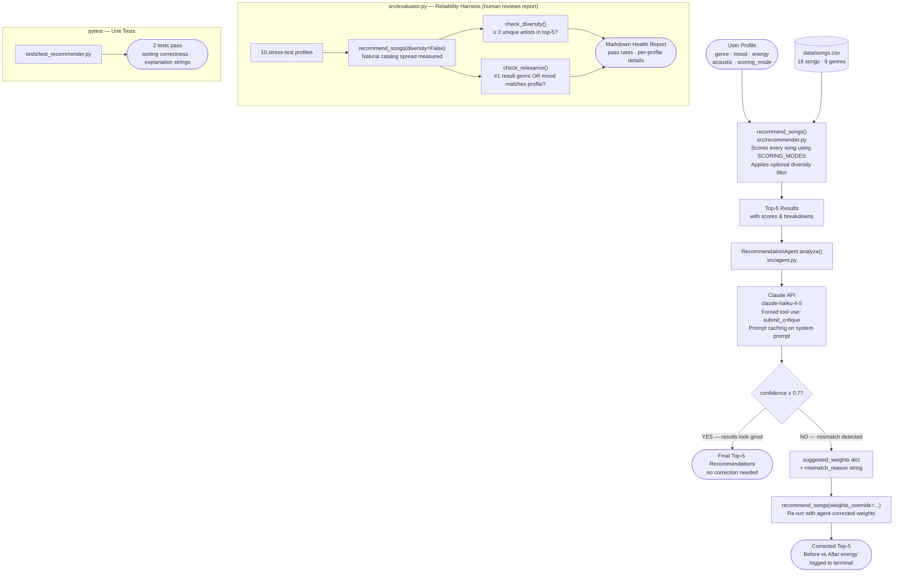

# VibeFinder 1.0 — System Architecture

## Full System Diagram

## Data Flow Summary

| Step | Component | Input | Output |
|---|---|---|---|
| 1 | `load_songs()` | `data/songs.csv` | list of 18 song dicts |
| 2 | `_score_song()` | song dict + user profile + weights | (score, reasons list) |
| 3 | `recommend_songs()` | user profile + all songs | top-k (song, score, explanation) tuples |
| 4 | `RecommendationAgent.analyze()` | user profile + top-5 | confidence, suggested_weights, mismatch_reason |
| 5 | Claude API (`submit_critique` tool) | formatted profile + results | structured JSON critique |
| 6 | `recommend_songs(weights_override=...)` | original profile + agent weights | corrected top-5 |
| 7 | `run_evaluation()` | 10 stress profiles | Markdown health report string |

## Where Humans Are Involved

- **Profile design** — the user defines their taste profile and picks a scoring mode
- **Evaluation review** — a human reads the Markdown health report to judge whether pass rates are acceptable
- **Agent oversight** — the `mismatch_reason` and `suggested_weights` are logged so a human can inspect what the LLM detected and why
